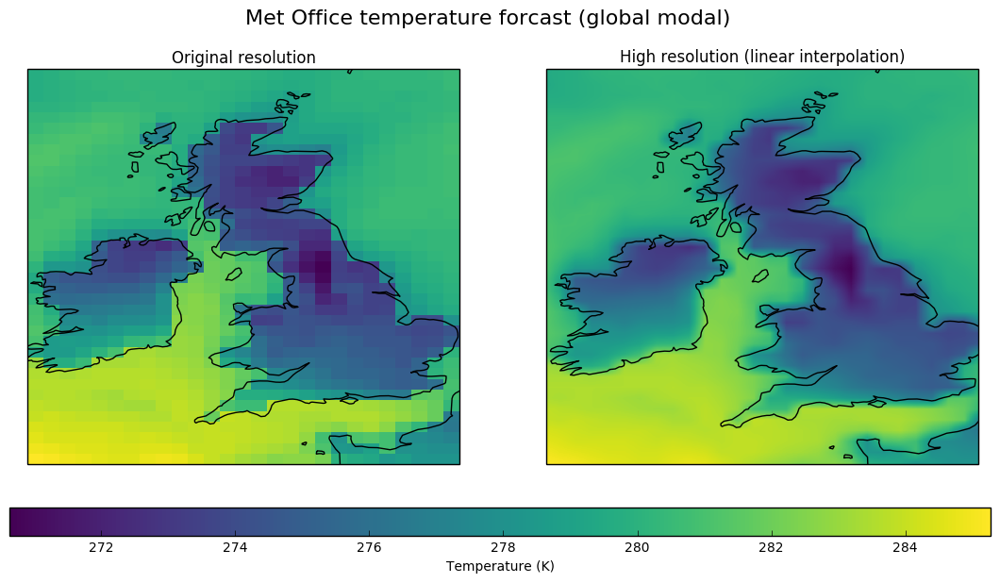

We've long been extolling the virtues of Dask, a Python module for parallelising code, and its sister module Dask Distributed, which lets you distribute analysis across a compute cluster. We thought it was about time we blogged about our experience of using it in anger. In this post, we talk about how we're using it to extend routines for regridding our atmospheric datasets.

## Regridding data
The atmospheric data fields from our Met Office models are defined on a latitude x longitude x time grid. We're currently working on a service to allow users to request this data, but on a different grid of their choosing. In order to do this regridding quickly, we're parallelising the work using Dask.

We're doing the regridding using Iris, the Met Office's excellent open source data analysis module. The results below use a 2D linear interpolation scheme to try and guess what a high resolution version of the same output would look like.

