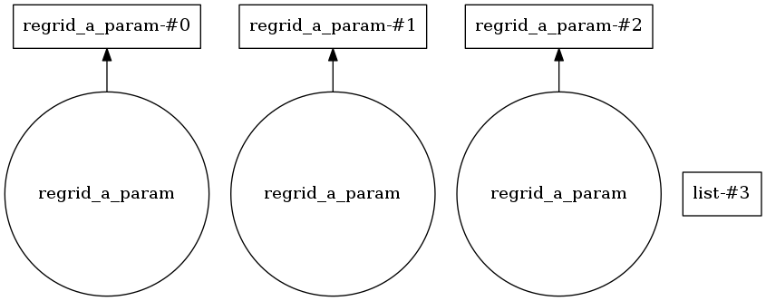
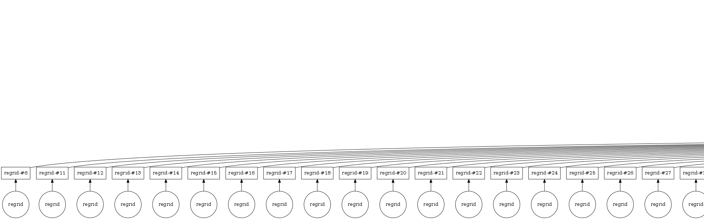

We've long been extolling the virtues of Dask, a Python module for parallelising code, and its sister module Dask Distributed, which lets you distribute analysis across a compute cluster. We thought it was about time we blogged about our experience of using it in anger. In this post, we talk about how we're using it to extend routines for regridding our atmospheric datasets.

## Regridding data
The atmospheric data fields from our Met Office models are defined on a latitude x longitude x time grid. We're currently working on a service to allow users to request this data, but on a different grid of their choosing. In order to do this regridding quickly, we're parallelising the work using Dask.

We're doing the regridding using Iris, the Met Office's excellent open source data analysis module. The results below use a 2D linear interpolation scheme to try and guess what a high resolution version of the same output would look like.


## Our code flow
We've took a pretty functional approach to how we process this data. To spare you from the gory details (which you can find in our GitHub repo), we've translated to really stripped down meta-python below.

python
```
def main(times, lons, lats, params):
    """
    An API will provide the times, latitudes, and longitudes that the data is to
    be regridded onto. It also provides a list of physical 'parameters' to regrid e.g. 'surface temperature'
    or 'rainfall amount'.

    """

    data_files = find_relevant_files(lats, lons, times, params) # Not defined here
    regridded_data = regrid_data(data_files, lats, lons, times, params)


def regrid_data(data_files, lats, lons, times, params)
    """
    Deal with each different physical parameter in turn
    
    """
    regridded_data = [regrid_a_param(a_param_name, data_files, lats, lons, times) for a_param in params]
    return regridded_cubes
    

def regrid_a_param(a_param_name, data_files, lats, lons, times):
    data = load_data(data_files, a_param_name)
    template_data_grid = make_template_grid(lats, lons, times) # Not defined here
    regridded_chunks = [regrid_a_chunk(data, a_template_chunk) for a_template_chunk in template_chunks]
    regridded_data = rejoin_chunks(regridded_chunks) # Not defined here
    
    return regridded_data


def regrid_a_chunk(source_data, template_data ):
    return regrid(source_data, template_data)
```

You can see that we have split the regridding step into bite-sized chunks which can then be joined back together. Our challenge was to figure out how to use Dask to do this. Instead of telling you the answer straight away, we thought we'd tell you about how we got there.

### Attempt one: `delayed`
Dask `delayed`s seem to be magic. You just take a function from your code, and use Dask to convert it into a `delayed` function (maybe using the funky `@delayed` decorator). Now, when you call your function, it doesn't get executed straight away, but instead returns a `future`, or a kind of promise that, when you need the function to be called at some point in the future, the function will be invoked. By combing this with the Dask `distributed` scheduler, these latent function calls can be farmed out to a cluster of compute nodes. One of the real attractions of this approach is the suggestion that you might not need to restructure your code in order to distributed it. Once enlightenment is attained, studious application of the `@delayed` should allow our code to magically run a lightening speed.

So far so great...but how do we actually do that in the real world?

Instead of telling you the answer, we thought it might be helpful to first tell you what we thought might be the answer but wasn't. Our first line of though went like this:
> Well, we want `regrid_a_param` to be distributed, and we want `regrid_a_chunk` to be distributed, so we'll just bang the magic `@delayed` decorator on both of them. When running that we found that our `rejoin_chunks` function, which expects a list of data objects, gets given a list of `futures` i.e. soon-to-be data objects, and throws. So...decorate that one too?So

Dask provides a graph of its latent compute operations, which is really helpful to understand what it's up to. The graph from our first attempt looked like this.



We called this a list of three different parameters. It looks like this graph is planning on distributing a processing each parameter at the same time, but our regridding chunks are nowhere to be seen. Ideally we want to be paralellising these operations as well.

A breakthrough came after meditating on the wisdom of the Dask Father, Matt Rocklin. In particular, this:
>...you should not use delayed functions within other delayed functions (unless you are doing something very strange). However you can pass delayed values into other delayed functions...Generally you want to immediately call any code that builds out your task graph and delay any function that just does work.

from a [Stack Overflow post](https://stackoverflow.com/questions/44427981/how-to-recursively-compute-delayed-in-collection) and this line

> A Delayed supports most python operations, each of which creates another Delayed representing the result.
from the [`delayed` documentation](http://dask.pydata.org/en/latest/delayed-overview.html).

This means that we do want to `delay` the `regrid_a_chunk` function (as it 'just does work'). On the other-hand, `regrid_a_param` is just doing some house keeping before calling `regrid_a_chunk`, or 'building our [our] task graph', so it shouldn't be a `delayed` function.

This small change was to parallelise both the processing of chunks, and parameters, giving a graph like this:
